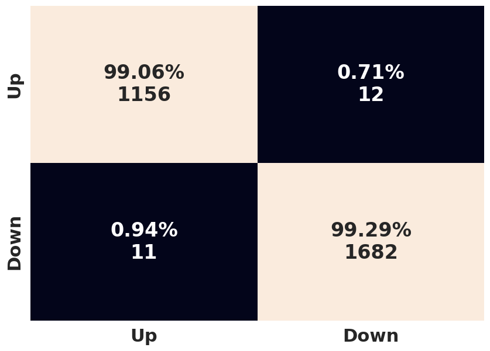
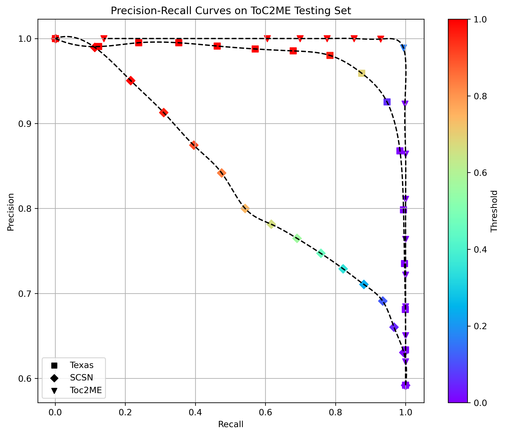
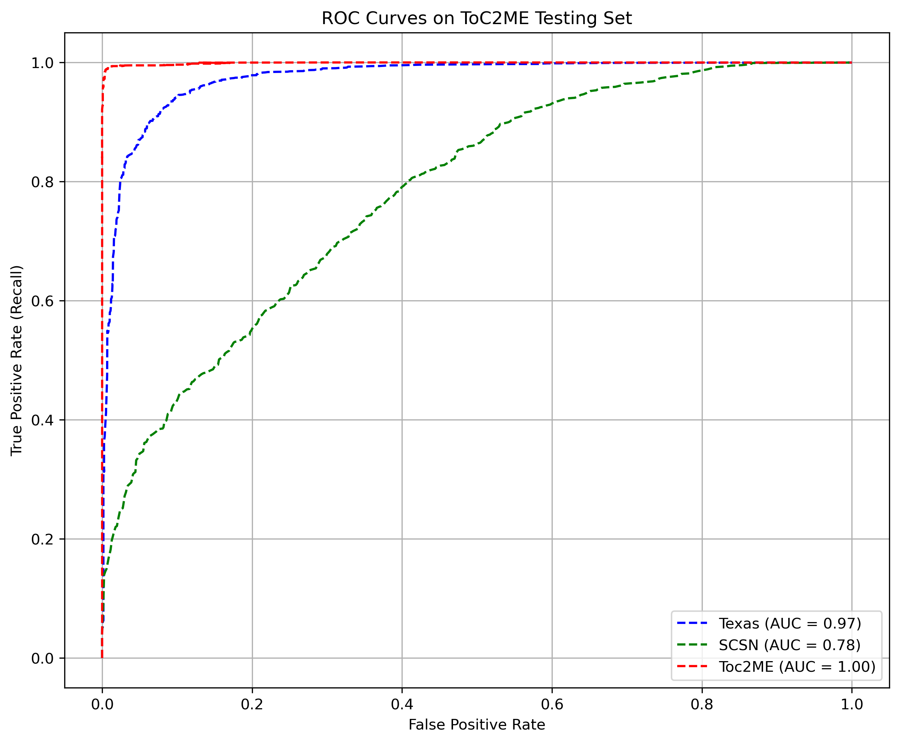
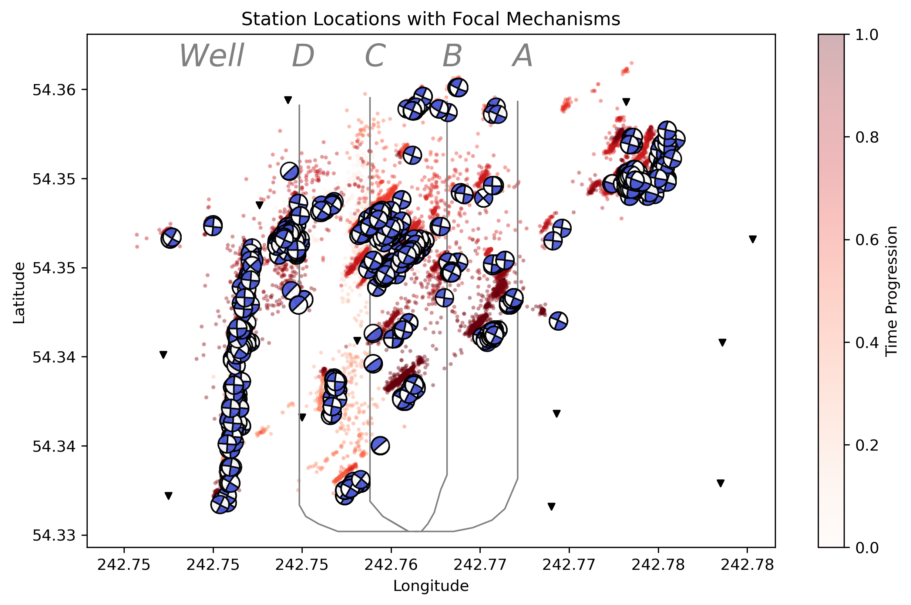
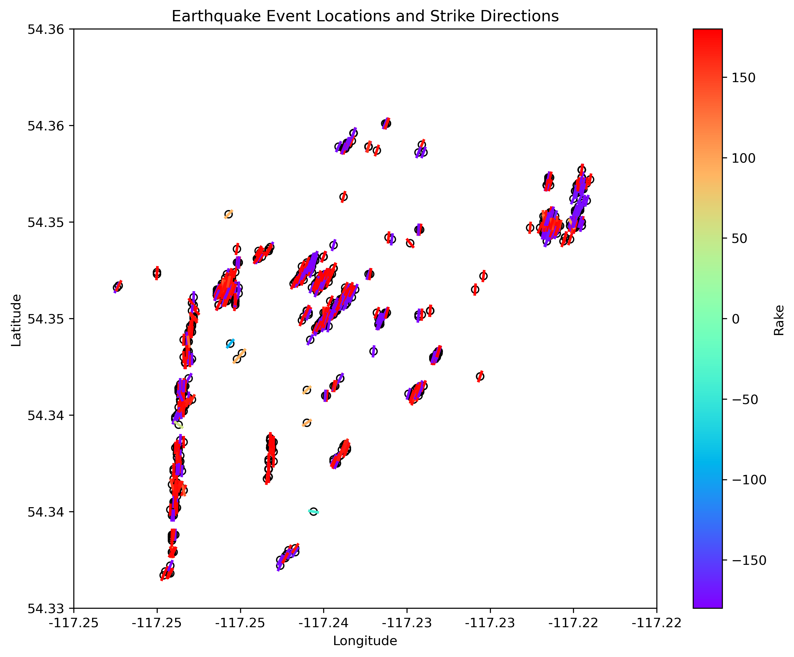
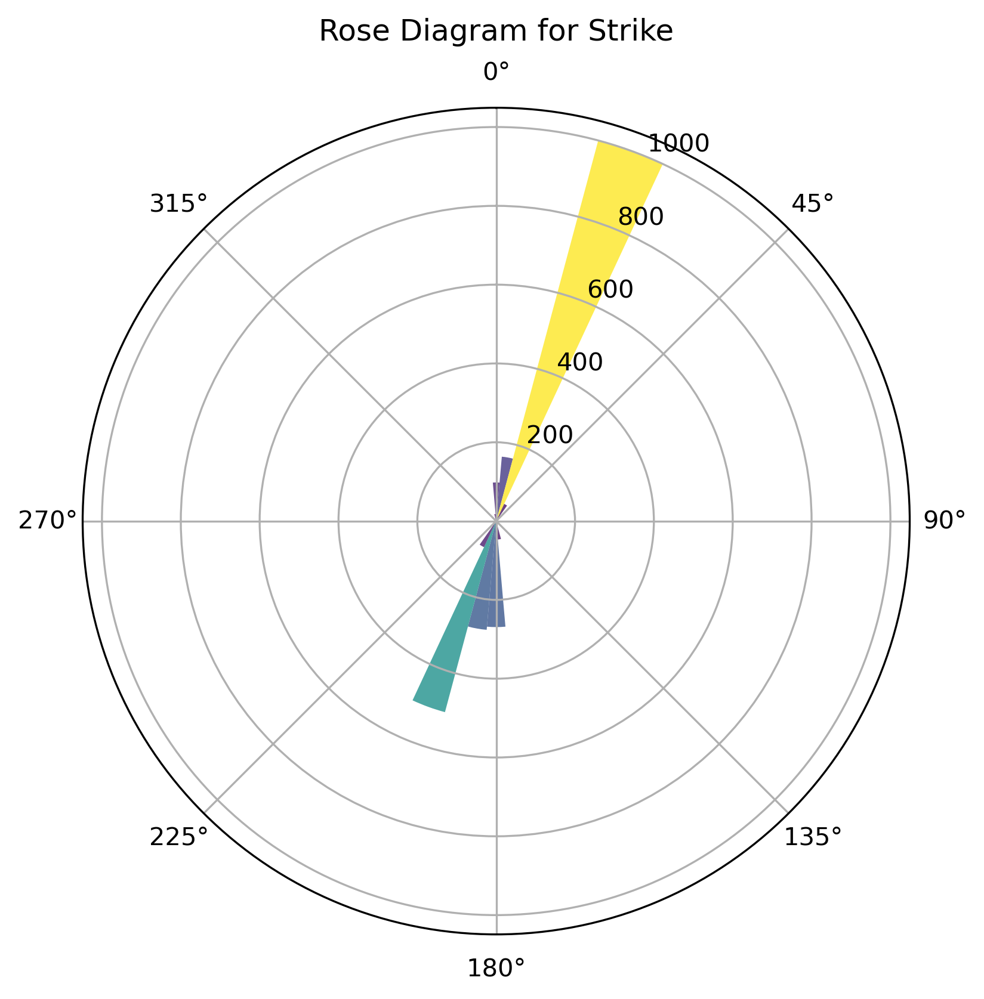
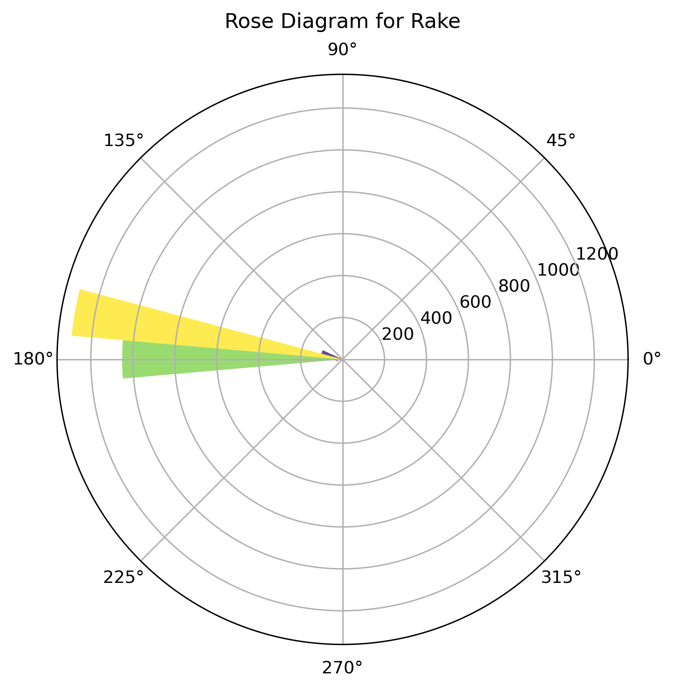
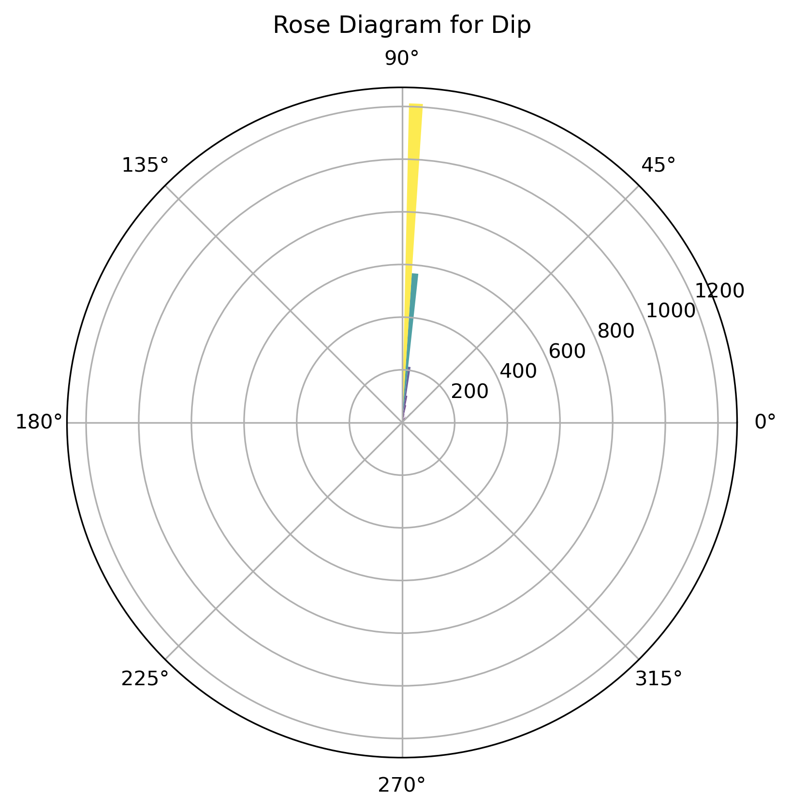

# JiachenToc2Me
**JiachenToc2Me** is Jiachen Hu's code repository for polarity picking and focal mechanism analysis in Canada.

## Overview
This repository provides a comprehensive set of tools and workflows for working with the ToC2Me dataset. The main components of this repository are:

## 1. HASH Workflow

### Description
This section outlines the process for solving focal mechanisms using the SKHASH on the ToC2Me dataset. Users can choose to either manually pick polarities or utilize the EQpolarity model for automatic polarity picking.

---

## 2. Focal Mechanisms Analyses

### Description
This section includes a set of scripts that allow users to visualize the spatial distribution of the focal mechanisms as well as their strike, dip, and rake characteristics within the ToC2Me dataset.

---

## 3. Plot Waveforms on Focal Mechanisms

### Description
This component provides scripts that enable users to plot waveforms directly on focal mechanism beachball diagrams. This feature helps validate the correctness of the mechanism solutions by allowing users to check waveforms and station locations.

### Notes:
- In the ToC2ME dataset, waveform polarities are inverted.

---

## 4. EQpolarity Transfer Learning

### Description
This section demonstrates the application of transfer learning using EQpolarity models on the ToC2Me dataset.

---

## Gallery
Here are examples of the outputs produced by the workflow:

### Accuracy on Microseismic Events（ToC2ME）
- Accuracy for each model can be obtained from [Code_ToC2ME/EQpolarity_Transfer_Learning/CCT_ToC2ME_TransferLearning_20240926_For_Test_update20241013.ipynb](https://github.com/chenyk1990/jiachenToc2Me/blob/main/Code_ToC2ME/EQpolarity_Transfer_Learning/CCT_ToC2ME_TransferLearning_20240926_For_Test_update20241013.ipynb)

#### The models are as follows
- Blue: [model/SCSN/best_weigths_Binary_SCSN_Best.h5](https://github.com/chenyk1990/jiachenToc2Me/blob/main/model/SCSN/best_weigths_Binary_SCSN_Best.h5)
- Orange: [model/Texas/best_weigths_Binary_Texas_Transfer10.h5](https://github.com/chenyk1990/jiachenToc2Me/blob/main/model/Texas/best_weigths_Binary_Texas_Transfer10.h5)
- Red: [model/Toc2me_20240819_Transfer_Learning_21916data/best_weigths_Binary_Toc2me_Transfer_SCSN_20241013_21916data_90.h5](https://github.com/chenyk1990/jiachenToc2Me/blob/main/model/Toc2me_20240819_Transfer_Learning_21916data/best_weigths_Binary_Toc2me_Transfer_SCSN_20241013_21916data_90.h5)


### EQpolarity Transfer Learning Confusion Matrix, PR Curve, ROC Curve with Canada Best Model
- Generated by [Code_ToC2ME/EQpolarity_Transfer_Learning/CCT_ToC2ME_TransferLearning_20240926_For_Test_update20241013.ipynb](https://github.com/chenyk1990/jiachenToc2Me/blob/main/Code_ToC2ME/EQpolarity_Transfer_Learning/CCT_ToC2ME_TransferLearning_20240926_For_Test_update20241013.ipynb) with model [model/Toc2me_20240819_Transfer_Learning_21916data/best_weigths_Binary_Toc2me_Transfer_SCSN_20241013_21916data_90.h5](https://github.com/chenyk1990/jiachenToc2Me/blob/main/model/Toc2me_20240819_Transfer_Learning_21916data/best_weigths_Binary_Toc2me_Transfer_SCSN_20241013_21916data_90.h5)




### Top View of Focal Mechanisms
- Generated by [Code_ToC2ME/Focal_Mechanisms_Analyses/Mapping.py](https://github.com/chenyk1990/jiachenToc2Me/blob/main/Code_ToC2ME/Focal_Mechanisms_Analyses/Mapping.py)


- Generated by [Code_ToC2ME/Focal_Mechanisms_Analyses/Strike_rake_mapping_with_mt_solution.py](https://github.com/chenyk1990/jiachenToc2Me/blob/main/Code_ToC2ME/Focal_Mechanisms_Analyses/Strike_rake_mapping_with_mt_solution.py)


### Rose Diagrams in ToC2ME
- Generated by [Code_ToC2ME/Focal_Mechanisms_Analyses/rose_figure_upgrade_with_dip.py](https://github.com/chenyk1990/jiachenToc2Me/blob/main/Code_ToC2ME/Focal_Mechanisms_Analyses/rose_figure_upgrade_with_dip.py)




#### Focal mechanisms on the right are generated by:
- Red: [Code_ToC2ME/Classify_focal_mechanism_types/group1/plot_mechanism_group1.py](https://github.com/chenyk1990/jiachenToc2Me/blob/main/Code_ToC2ME/Classify_focal_mechanism_types/group1/plot_mechanism_group1.py) 
- Blue: [Code_ToC2ME/Classify_focal_mechanism_types/group2/plot_mechanism_group2.py](https://github.com/chenyk1990/jiachenToc2Me/blob/main/Code_ToC2ME/Classify_focal_mechanism_types/group2/plot_mechanism_group2.py)
- Green: [Code_ToC2ME/Classify_focal_mechanism_types/group3/plot_mechanism_group3.py](https://github.com/chenyk1990/jiachenToc2Me/blob/main/Code_ToC2ME/Classify_focal_mechanism_types/group3/plot_mechanism_group3.py) 


### 3D Visualization of Seismic Events for Group2
- Generated by [Code_ToC2ME/Classify_focal_mechanism_types/Mapping4_3D.py](https://github.com/chenyk1990/jiachenToc2Me/blob/main/Code_ToC2ME/Classify_focal_mechanism_types/Mapping4_3D.py)


### Waveforms on Focal Mechanisms
- Generated by [Code_ToC2ME/Plot_waveform_on_mechanisms/Focal_mechanism_with_waveform_individually.py](https://github.com/chenyk1990/jiachenToc2Me/blob/main/Code_ToC2ME/Plot_waveform_on_mechanisms/Focal_mechanism_with_waveform_individually.py)


---

## Data
1. ToC2ME data: https://doi.org/10.5281/zenodo.13902345

2. Texas data: Google Drive link: https://drive.google.com/drive/folders/1WXVB8ytNB4bOaZ97oq6OmMRyAEg95trp?usp=sharing

3. Texas_22980 data: https://doi.org/10.5281/zenodo.13901460

4. ToC2ME_Testing_data: In the `data` folder

---

## Environment Setup

To create and set up the required environment, follow these steps:

```bash
# Step 1: Create a Conda environment with Python 3.11.7
conda create -n eqp python=3.11.7

# Step 2: Activate the Conda environment
conda activate eqp

# Step 3: Install Jupyter Notebook
conda install ipython notebook

# Step 4: Install additional dependencies
pip install matplotlib==3.8.0 tensorflow==2.14.0 scikit-learn==1.2.2 seaborn==0.13.2
